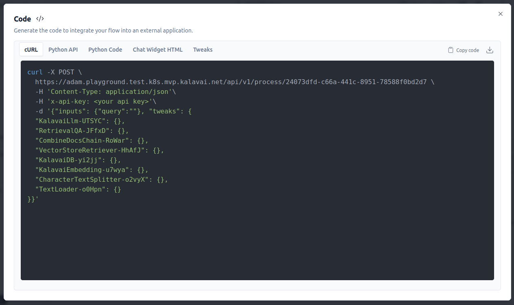

# Build and Deploy a Flow on Kalavai

Welcome to the Kalavai Flow Deployment tutorial! In this guide, we'll explore the Kalavai AI no-code environment. Using freely available Kalavai AI components, including LLMs, Embeddings Models, and Vector Stores, we'll build and deploy a complex AI-enabled flow, __hosted and deployed for free on the Kalavai Network__.

To get started, we need to visit the [Kalavai Platform](https://platform.kalavai.net/) where new users can sign up, or existing users can log in.

If you want to jump into a fully commisioned RAG system, you can find the full flow file [here][example_flows/], ready to import to a fresh flow, or the whole [collection](example_collection) which you can upload to the main Agent Builder UI, using the Upload Collection button.

__NOTE__: You will need to upload you're own documents into the UsntructuredMarkdownLoader to compile, after uploading the flows.

Keep reading, and we'll go step by step into how to build your RAG system.

## Deploying the Kalavai Agent Builder

The Kalavai Agent Builder is one of several services you can host on the Kalavai network, and use to build AI empowered agents, which you can further deploy on the Network.

Here're we'll quickly go through the steps to use the Agent Builder.

1. Log into the [Kalavai Platform](https://platform.kalavai.net/) or sign up for a new account.

2. Create a new Agent Builder Instance

Clicking on __Agent Builder__ in the navigaton, we can open up the Agent Builder deployment page. The Agent Builder will require its own Password, so that you can securely log into the deployment, remember these for later, if it is not the same as your Kalavai Password.

Clicking deploy will begin the deployment process, this may take serveral minuites, and require a manual refresh using the Refresh Button.

3. Deploy the Agent Builder

When the agent is deployed, as you press refresh you will be presented with a new Langflow instance

4. Log into Langflow

This is where you can use the password and username that you created at step 3, to log in. Your username will be prompted in the green box to help you remember.

5. Start Building

From here you can upload our collection of flows, or get started, by following "Start Here" and follow to Rag Build Tutorial below!

## What is a Flow?

A flow is an end-to-end AI-driven pipeline that integrates multiple components to achieve a complex, standalone behavior, such as question answering, entity extraction, conversational chat, and tool use.

Today, we'll build a Question Answering (QA) flow using Retrieval Augmented Generation (RAG), a flow that answers questions based on a collection of documents you provide.

## What is Retrieval Augmented Generation?

Retrieval Augmented Generation (RAG) is an advanced approach in natural language processing that combines retrieval-based and generation-based techniques. It enhances the capabilities of language models by providing them with relevant external information, leading to more accurate and context-aware responses.

### When to Use a RAG Pipeline:

1. **Complex Queries:** For dealing with complex or multi-faceted questions that require information from various sources.
2. **Large Knowledge Bases:** When context or answers need to be drawn from a large and diverse set of documents.
3. **Dynamic Content:** In scenarios where information changes frequently, such as news updates, scientific research, or social media trends.

### Why Use a RAG Pipeline:

1. **Improved Accuracy:** Combining retrieval and generation provides more accurate and relevant answers compared to standalone models.
2. **Enhanced Contextual Understanding:** Ensures the generated content is contextually rich and informed by the latest available data.
3. **Efficiency:** Efficiently handles vast amounts of data, making it suitable for applications like chatbots, virtual assistants, and question-answering systems.

A RAG pipeline typically consists of three major parts:

1. **Retriever**
   - **Function:** Searches a large corpus of documents or knowledge base to find relevant information based on a given query.
   - **Key Techniques:** Uses algorithms like BM25 or dense passage retrieval (DPR) for efficient and effective searching.

2. **Reader**
   - **Function:** Processes the retrieved documents to generate a coherent and contextually appropriate response.
   - **Key Techniques:** Utilizes transformer-based models like BERT, GPT, or T5 to interpret and generate text based on the retrieved information.

3. **Generator**
   - **Function:** Combines information from the retriever and reader to create a final, polished response.
   - **Key Techniques:** Employs Large Language Models to understand source documents, and sythesise direct, short answers.

## Building a Question Answering RAG Flow

We will use the Kalavai No-Code platform and the freely available Kalavai Components to build and deploy a simple Question Answering flow. The full flow, allowing question answering over a simple text file, looks like this:

While there are many parts to the pipeline, the Kalavai Platform UI makes it easy to build and configure. You'll have a working, Kalavai-hosted flow in no time, ready to expand and make your own. Let's get started.

### Start a New Flow

### The Retrieval QA Chain

The first component we will add is the __Retrieval QA Chain__. This chain orchestrates all of the Retrieval and LLM Components required to get your Flow working. You can find it under __Chains > RetrievalQA__.

This component has three input pins: __Combine Documents Chain__, __Memory__, and a __Retriever__.

We will focus on the __Combine Documents Chain__ pin and the __Retriever__ pin, starting with building the __Retriever__ section of the flow, which begins with a __VectorStore Retriever__.

### Adding the Vector Store Retriever

We will use a Vector Store Retriever, which uses a Vector Database as our core document representation location. Add a new __Vector Store Retriever__ from the __Retrievers > VectorStore Retriever__ menu item.

The __VectorStore Retriever__ has no parameters and manages how to retrieve documents from a __Vector Store__ with its single pin.

### Adding the Vector Store

The vector store is the underlying storage for our vectors, which will encode the data we put into the system. Add a new __Kalavai Vector DB__ component using the __Vector Stores > Kalavai VectorDB__ menu item and connect it to the __Vector Store__ pin on the __VectorStore Retriever__.

The vector store has three parameters:
1. **Collection Name:** An arbitrary name to label your collection.
2. **Persist:** A toggle to determine if the data should be persisted for you.
3. **Directory:** The directory to persist the indexed information.

For this demo, we can safely ignore the second and third parameters and call the collection name "rag_data" for now.

Next, we have two more pins to connect to complete the _Vector Store_ pin: _Documents_ pin and _Embedding_ pin.

The _Embedding_ pin specifies how we will encode each item in the Vector DB using its own Pretrained Machine Learning model called an Embedding Model.

We can use the __Kalavai Embeddings__ component to do the data indexing for us and come back to the _Documents_ pin later.

### Adding the Embeddings Model

Kalavai provides free and performant Embeddings Components, hosted on the distributed Kalavai Network, to index your documents and encode your queries. Embeddings models are the core magic of a RAG system.

You can add the __Kalavai Embeddings__ component from __Embeddings > Kalavai Embeddings__.

This component will convert both your questions and your documents into vectors, which can be searched using a semantic search approach to capture deep similarities in meaning. The Embedding Model has a single, important parameter: the name of your Embedding Model.

For this demo, let's use a good, general model: __"BAAI/bge-large-en-v1.5"__.

This is the only setting we need to set for the embedding model, and as there are no more pins that need filling, we have finished what we need to do here.

Let's head over to the Documents pin on the Kalavai DB and start populating our database.

### Splitting up your documents

When you supply documents to your rag, as soon as you get to longer and longer documents, you're going to want to split your documents up into smaller, managable chunks. To do this we add a __Character Text Splitter__

The Character Text Splitter is a basic splitter with the following parameters:
1. Chunk Overlap: How much information is shared between chunks, in characters
2. Chunk Size: The length of a chunk, small chunks can be more targeted, but may not have all the information required.
3. Separator: A character used to split the document into different meaningful sub chunks, that are combined up to the Chunk size.

The only pin to this component, is to finally attach the _documents_ of your choice.

### Adding Some Custom Documents to Your Flow

There are many ways to add data to your RAG Pipeline, such as indexing text files, PDFs, directories, websites, databases, and more. You can find an exhaustive list under the __Loaders__ menu.

For this demo, while we are testing the end-to-end process, let's use a single PDF document, that we can upload directly into the component. Add an __PyPDF Loader__ from the __Loaders > PyPDFLoader__ menu item.

Here you can see the main parameter __File Path__ where you can click to add a new .md file.

We can safely ignore the MetaData fields for now, which could be used in more complicated RAG setups to do filtered searches.

You can also use the __Text Loader__ component for pure txt files.

With a single document added, we have built the full retriever side of the flow.

That completes the Retriever Chain. We now have some data, a Kalavai-hosted embeddings model, and a Kalavai-hosted vector database, all leading into the __Retriever QA Chain__. Now we need to go back to the __Retriever QA Chain__ and fill out the remaining required pin, the _Combine Documents Chain_ pin.

### Add the Combine Documents Chain

The Combine Documents Chain determines how we can combine all of the results from the retriever to fit them into the context window of our Large Language Model (LLM).

The __Combine Documents Chain__ is a simple component that can be added from the __Chains > Combined Documents Chain__ menu item.

The component has one parameter, __Chain Type__, which determines how we put our retrieved documents into the LLM window. We can keep the default "stuff" parameter for now, which attempts to stuff as many documents as possible into the LLM until the context limit is reached.

We also have a single, last pin for the _LLM_, which will do the heavy lifting of taking the documents and answering the question.

### Add the Kalavai LLM

The LLM is the engine of the Question Answering system, synthesizing all of the documents found by the retriever into a single, cohesive answer.

Kalavai provides two language models free of charge, which are medium-sized Language Models deployed on the Kalavai network, trained for instruction-following behavior.

Add the __Kalavai LLM__ component from __LLMs > KalavaiLLM__ and decide what underlying model to use for the Model Name parameter.

We have the choices of:
1. [Llama3 8b Instruct](https://huggingface.co/meta-llama/Meta-Llama-3-8B-Instruct) released by Meta.
2. [Saul-Instruct-v1](https://huggingface.co/Equall/Saul-Instruct-v1), a legal-focused Open LLM.

We can also set the [temperature](https://www.iguazio.com/glossary/llm-temperature/) of the model, which determines how predictable the outputs will be. Lower temperatures near 0 will be less creative, generating the most "likely" outcomes.

Finally, there is the __Max Tokens__ parameter, which determines the maximum number of tokens that will be generated in your answer. We can leave the default at 256 for now, but feel free to play with this when we have completed. More tokens could mean more complete answers, at the expense of answer speed.

## Test Your RAG Pipeline

Finally, you can compile your Flow by clicking on the lightning icon in the bottom right:

You should see a "Flow is ready to run" message on completion!

Now, clicking on the blue chat icon, you can go ahead and test out your first Flow on the Kalavai Network.

## Deploy Your Flow to Kalavai

When you have built the flow you want, and tested out the Chat function inside the Agent Builder, your next stop is to be able to execute that flow from code, so you can start to put it to good use!

We can do this, by deploying the Flow out to the Kalavai Network, by following these steps!

1. Download a copy of your Flow

1. Get a copy of the Flow API Key from the user interface.

You can see the key icon on the top right of the Agent Builder, click this to see your key management screen.

From here, you can create a new key. These are the keys that people can use to access your flows. This means you do not need to share any other keys with external users.

Give your new key a name, and click create secret key.

This will give you the key you need, copy this to your clip board, and save it somewhere, you will need this in your code, to call your API. If you lose it, you cannot get it back, but you can at least generate new ones as you need.

Finally this will take you back to the API keys screen. 

From you will want to go back to your flow, by clicking the name in the 
top left corner.

From here we will export your Flow, using the download button in the top left corner. Also, take a note of the _code_ icon here. This is where you can find code example to see how to access your flows once you deploy them!

Moving on, name your flow and download it. From this point on we need to go back to using the main Kalavai interface, and we will click on  __Deploy__ on the right hand side kalavai menu.

This shows us all our current deployments, you can see your Agent Builder here. We are going to want to create a new deployment, by clicking the Deploy button up at the top right. 

From here we will want to Name our new deployment, attach the json flow we previously downloaded, and copy in the API key that we copied from the Agent Builder in an earlier step.

From this, your flow will successfully deploy, and you can see it here in your deployments list.

You can click the _endpoint_ link on the right to examine the documentation for your deployment! This will take you to the public url of your newly deployed AI Flow. 

You will see a message saying `detail	"Not Found"`. This is expected, as the endpoint is the machine-accessable url. To inspect to docs add "/docs" to the url to see what has actually been deployed!

For example, if your endpoint links to `https://adam.test.test.k8s.mvp.kalavai.net/` update it to `https://adam.test.test.k8s.mvp.kalavai.net/docs/` to see this FastAPI endpoint.

You will not be able to execute here, as the endpoint is API protected, but you can move into the land of code, and see how to call this endpoint in the [Provided Notebook](notebooks/Call_Agent_Flow.ipynb)

You can inspect the Agent builder Code Tab to see various examples of code usage:

## Exercised and Next Steps

Now that you have the basic structure in place, you can start to think about more complex knowledge-driven applications. A good place to start would be:

1. Adding more documents from different sources, including PDFs, Online Sources and online sources.
2. Changing the Prompts behind the Chains for a more personalised approach
2. Changing the QA Chain to a Sourced Chain.

