## Deploy Your Flow to Kalavai

When you have built the flow you want, and tested out the Chat function inside the Agent Builder, your next stop is to be able to execute that flow from code, so you can start to put it to good use!

We can do this, by deploying the Flow out to the Kalavai Network, by following these steps!

1. Download a copy of your Flow

1. Get a copy of the Flow API Key from the user interface.

You can see the key icon on the top right of the Agent Builder, click this to see your key management screen.
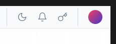

From here, you can create a new key. These are the keys that people can use to access your flows. This means you do not need to share any other keys with external users.

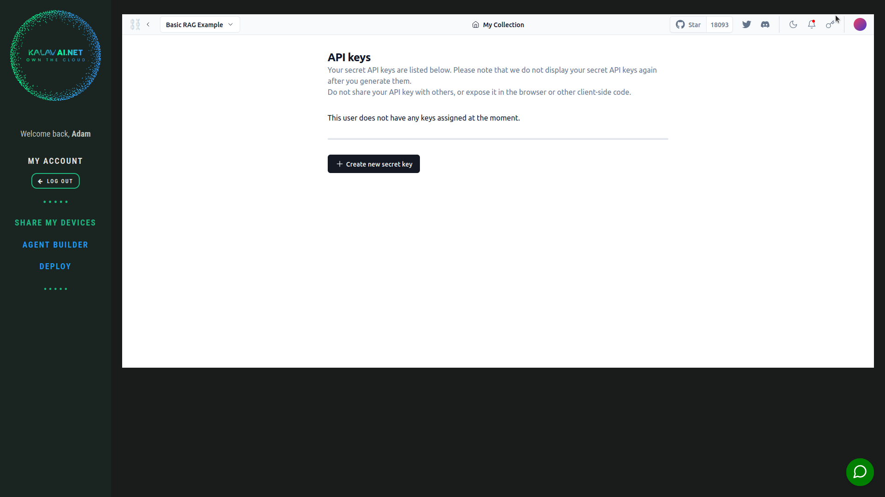

Give your new key a name, and click create secret key.

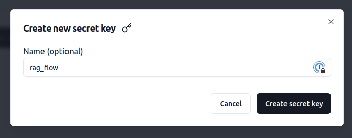

This will give you the key you need, copy this to your clip board, and save it somewhere, you will need this in your code, to call your API. If you lose it, you cannot get it back, but you can at least generate new ones as you need.

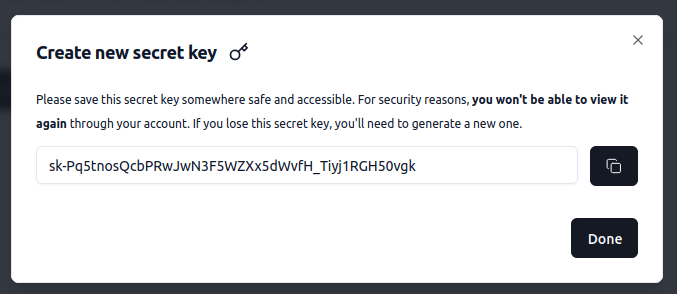
Finally this will take you back to the API keys screen. 

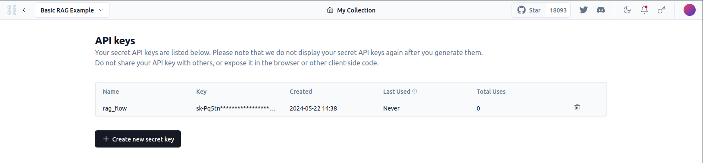

From you will want to go back to your flow, by clicking the name in the 
top left corner.

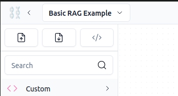

From here we will export your Flow, using the download button in the top left corner. Also, take a note of the _code_ icon here. This is where you can find code example to see how to access your flows once you deploy them!

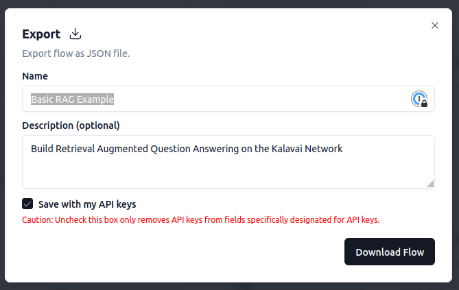

Moving on, name your flow and download it. From this point on we need to go back to using the main Kalavai interface, and we will click on  __Deploy__ on the right hand side kalavai menu.

This shows us all our current deployments, you can see your Agent Builder here. We are going to want to create a new deployment, by clicking the Deploy button up at the top right. 

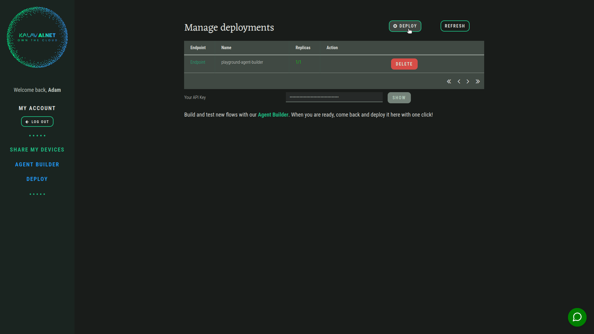

From here we will want to Name our new deployment, attach the json flow we previously downloaded, and copy in the API key that we copied from the Agent Builder in an earlier step.

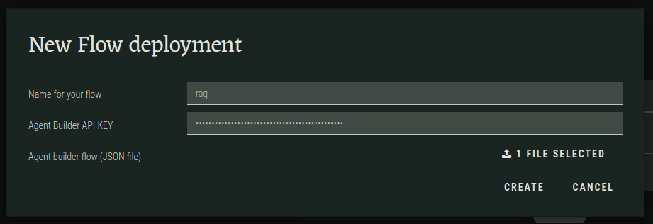

From this, your flow will successfully deploy, and you can see it here in your deployments list.

You can click the _endpoint_ link on the right to examine the documentation for your deployment! This will take you to the public url of your newly deployed AI Flow. 

You will see a message saying `detail	"Not Found"`. This is expected, as the endpoint is the machine-accessable url. To inspect to docs add "/docs" to the url to see what has actually been deployed!

For example, if your endpoint links to `https://adam.test.test.k8s.mvp.kalavai.net/` update it to `https://adam.test.test.k8s.mvp.kalavai.net/docs/` to see this FastAPI endpoint.

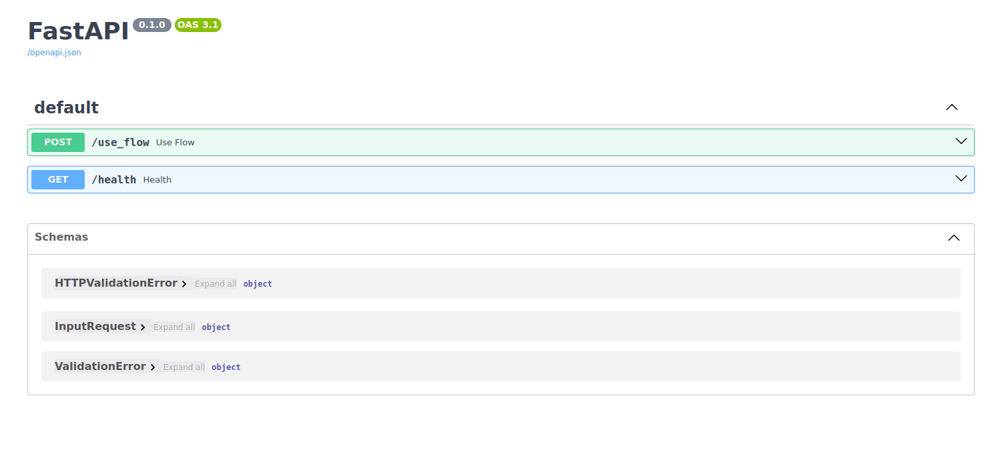

You will not be able to execute here, as the endpoint is API protected, but you can move into the land of code, and see how to call this endpoint in the [Provided Notebook](notebooks/Call_Agent_Flow.ipynb)

You can inspect the Agent builder Code Tab to see various examples of code usage:

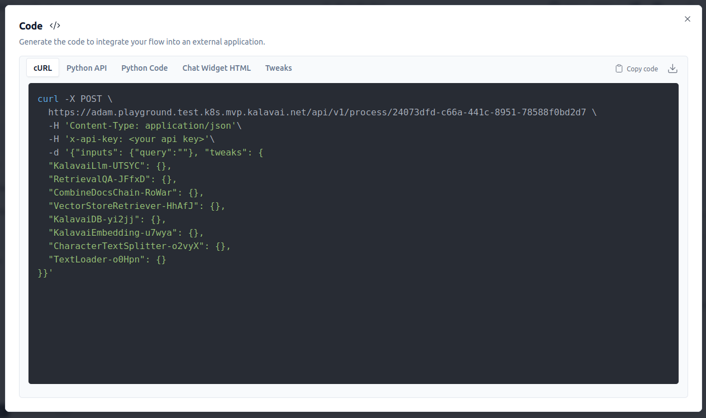
